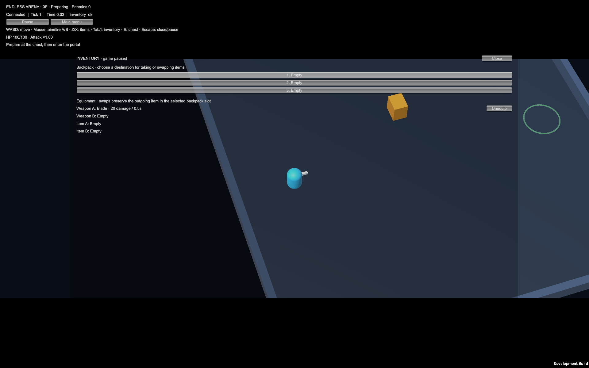
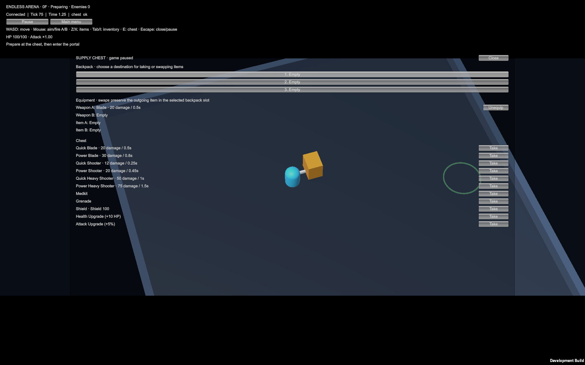
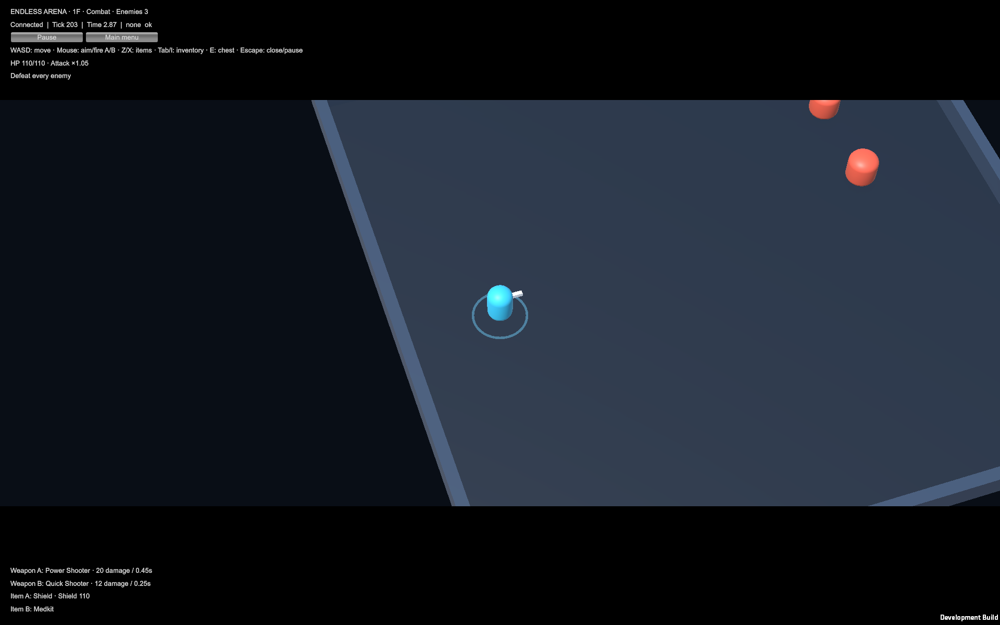
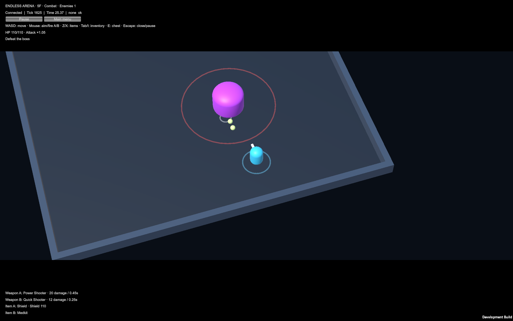
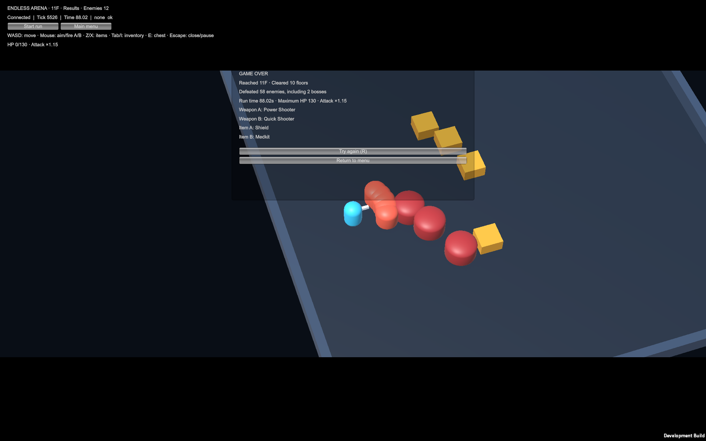
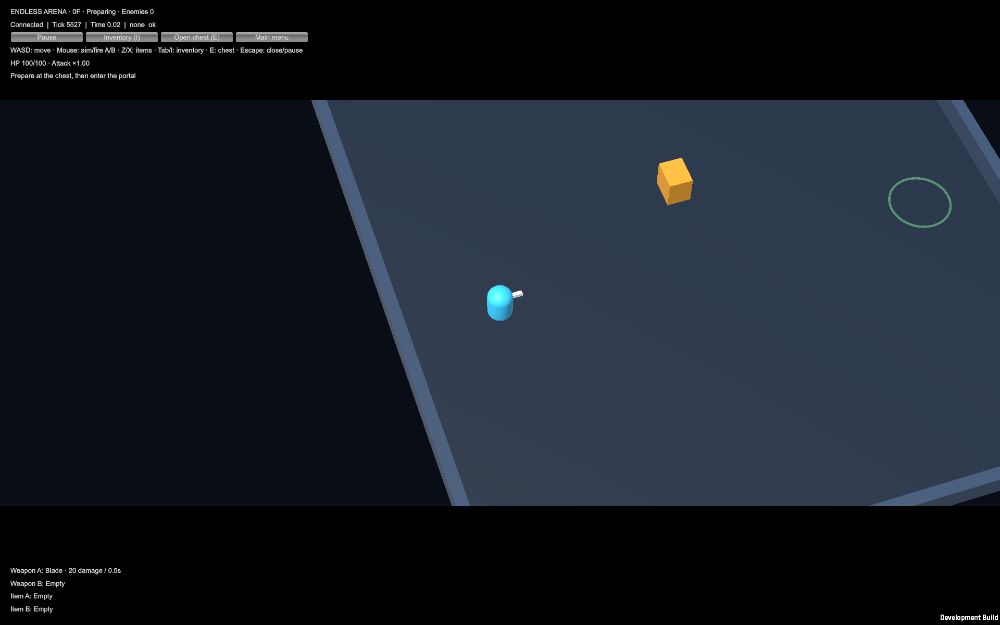
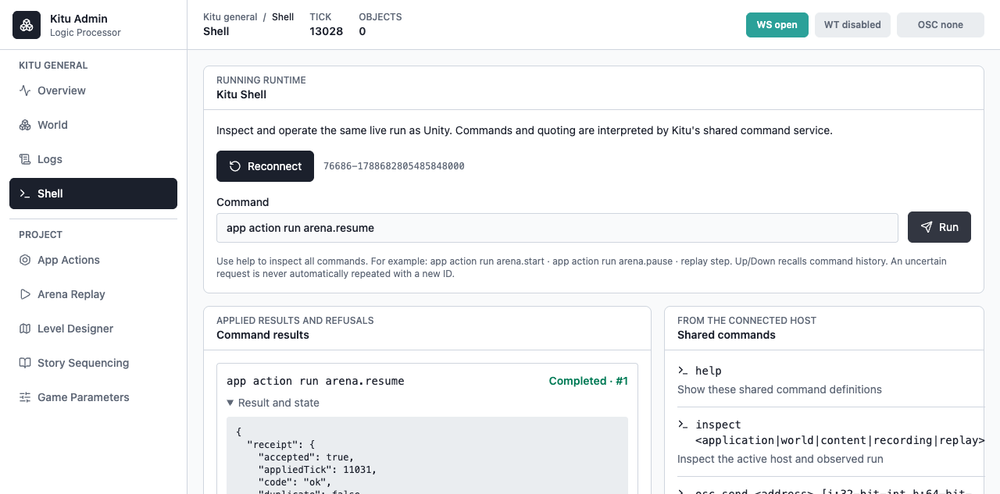
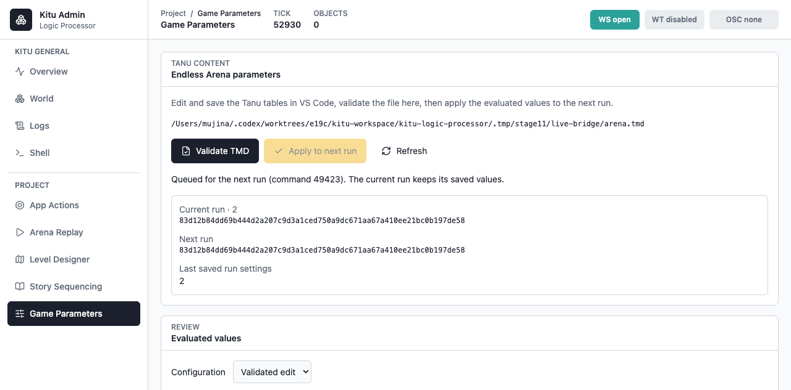
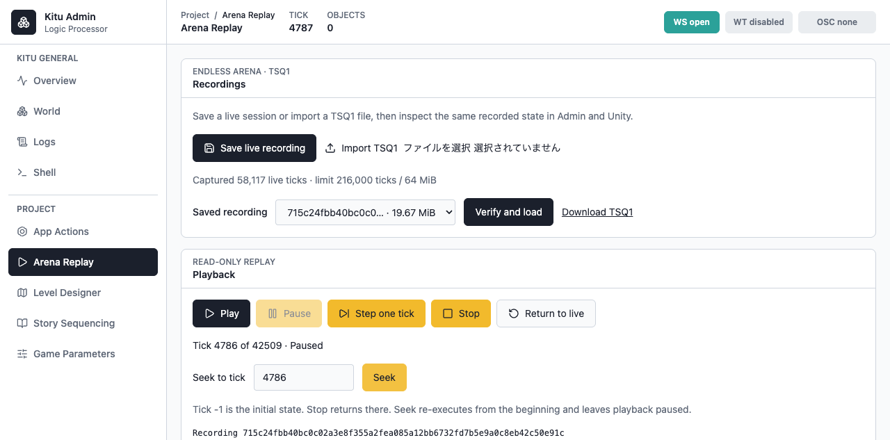

# Embedded Arena verification

Stage 11, including the queued playback-control review fix, was verified on 2026-09-06 with Rust 1.96.0, Unity 6000.6.0f1,
Apple Silicon macOS and the `aarch64-apple-darwin` target. The actual graphical
standalone app contains the complete native Arena application and uses Unity's
single 60 Hz scheduler. The frozen reference inputs and expectations were not
changed to obtain these results.

The native, C caller, plugin, standalone build and graphical Player reports were
refreshed after the queued-playback control review fix. Their final local source
artifacts are under `.tmp/stage11/review-*`; the initial evidence remains in its
original directories. Repeated native tests passed with normal loopback access
after the sandbox denied the bridge tests' socket bindings.

| Check | Result | Evidence |
| --- | --- | --- |
| macOS native application and bridge tests | 5 application tests, 5 HTTP/WebSocket/lifetime tests, 1 doctest passed | [Native verification](native-verification.json) |
| Actual C caller | Preparation 28 ticks / 40 inputs; stock 5,528 ticks / 5,581 inputs; complete state and output match | [Preparation](preparation-comparison.json), [stock](stock-comparison.json) |
| Native plugin packaging | ARM64, all 9 ABI exports, `@rpath` install name, system-only dependencies and signature verified | [Package](native-package.json) |
| Unity standalone build | ARM64, Mono, one bundled native library, matching plugin code and deep signature; 0 errors / 4 warnings | [Player build](player-build.json) |
| Graphical standalone preparation | 28 ticks / 40 inputs; inventory checkpoint rendered | [Player preparation](player-preparation.json) |
| Graphical standalone stock run | 5,528 ticks / 5,581 inputs; 11F death and retry observed, five checkpoints rendered | [Player stock](player-stock.json) |
| Full Unity EditMode suite | 50 passed, 0 failed or skipped | [Unity tests](unity-tests.json) |
| Full Unity PlayMode suite | 21 passed, 0 failed or skipped, including both server and embedded stock runs | [Unity tests](unity-tests.json) |

Both standalone fixtures ran with the task-owned external Arena server stopped;
the Player harness also disables its bridge and device input. The recorded
[container observation](server-stopped.json) covers before and after both runs.
The external server was restarted afterward for the server-path Unity tests.
The broader Rust/frontend and ordinary standalone CLI/Admin checks are indexed
by [results.json](results.json).

The Player compares each native state/output batch with the same-build Runtime
expectation. The Python runner independently compares its fresh `actual.ndjson`
against the requested expected file; equality applies to the complete decoded
JSON values, not serialization whitespace or object member order. Both reports
record input, expected, actual, executable, plugin and screenshot SHA-256 values.
The plugin inside the app has SHA-256
`35d90e9e91ac071644bf2e3171ab511ea7bd598621d6bc8618af9cb3ca4bcaae`.

The build runner's timeout cleanup was also exercised with a child process that
ignores SIGTERM after its leader exits. The [regression result](process-group-regression.json)
confirms the descendant was terminated. Reserved self-test argument overrides
are rejected before accessing any Player or fixture file.

The JSON reports are unchanged copies of generated evidence and retain the
original local artifact/log paths. Compact reports and the nine original PNGs are
retained in Git. The screenshots were added after publication was authorized;
their bytes match the original evidence. Large traces, native binaries, the `.app`,
Unity XML and console logs remain local generated artifacts under `.tmp/stage11/`
or `Builds/`. Screenshot hashes and original paths are retained in the reports.
Use the [macOS build and verification instructions](../../../kitu-integration-runner/unity-demo-game/README.md#reproduce-the-embedded-macos-build)
and the [native ABI instructions](../../specs/arena-native-abi.md) to reproduce them.

## Rendered checkpoints

All six PNGs were visually inspected. Preparation shows the paused inventory,
HP 100/100, the starter Blade and empty backpack. The stock run shows supply
chest contents, 1F combat, a 5F boss and projectiles, then the 11F result with
10 cleared floors, 58 defeated enemies, two bosses and 88.02 seconds. Retry
returns to 0F with HP 100/100, the starter Blade and empty remaining equipment.

## Ordinary standalone with CLI and Admin

[Initial live bridge evidence](live-bridge.json) records a separate normal Player session before the playback-control review fix
with device input enabled. Actual macOS CLI and browser Shell commands share its
session ID and applied receipts. Admin validated a real Tanu edit (starter damage
20 to 23), kept run 1 unchanged and activated it at run 2. The pre-edit TSQ1 file
contains 42,510 ticks; verification/load, step, seek to tick 4,786, continuous play,
pause and stop retained its original content hash. Return to live restored run 2
with the edited content and a paused game. No browser errors were reported.

The [final reviewed Player check](final-live-bridge.json) repeats real CLI and
browser Shell operations against the rebuilt native library. The old 42,510-tick
recording still verifies; concurrent HTTP steps return distinct verified states
at ticks 1 and 2, seek returns tick 4,786, and return-to-live restores pause before
browser Shell explicitly resumes the same session. All final native, C caller and
graphical Player reports above refer to this rebuilt library. The [review
regressions](review-regression.json) cover the refused and failed-step cases.
